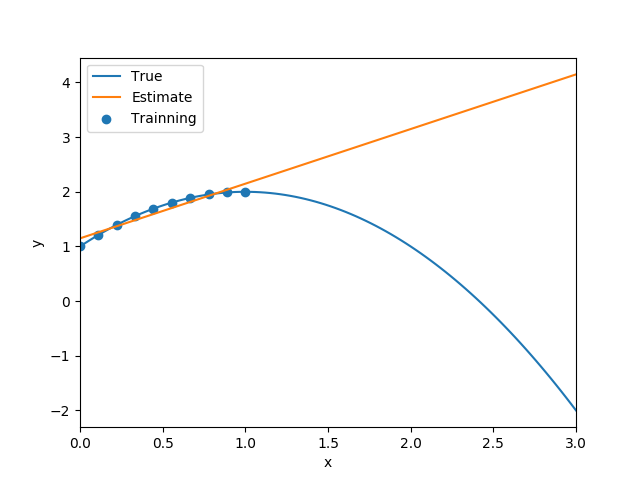

## Solution to Homework 3

Name: Chen Shen

NetID: cs5236

### 1.

(a)     
The model is linear.    
There is no under-modeling.     
The true parameters are $\beta0=1$, $\beta1=2$, $\beta2=0$. 

(b) 
The model in nonlinear.     
The function can be rewritten as $f_0(x)=1+\frac{1}{2+3x}=\frac{3+3x}{2+3x}$.       
So there is no under-modeling.      
The true parameters are $a_0=3$, $a_1=3$, $b_0=2$, $b_1=3$.

(c)     
The model is linear.
The function can be rewritten as $x_1^2-2x_1x_2+x_2^2$.       
There is under-modeling because the $x_1x_2$ term is missing.

### 2.

(a) The least-squares estimates should be   
$$
\hat{\beta_1}=\frac{s_{xy}}{s_x^2},~\hat{\beta_0}=\hat{y}-\hat{\beta_1}\bar{x},
$$
where
$$
\bar{x} = \frac{1}{n}\sum_{i=1}^N x_i,~
\bar{y} = \frac{1}{n}\sum_{i=1}^N y_i
$$

$$
s_x^2 = \frac{1}{n}\sum_{i=1}^N (x_i-\bar{x})^2,~
s_y^2 = \frac{1}{n}\sum_{i=1}^N (y_i-\bar{y})^2
$$

$$
s_{xy} = \frac{1}{n}\sum_{i=1}^n (x_i-\bar{x})(y_i-\bar{y})
$$

(b) The fomulas seem the same as the above expressions. But $y_i=\beta_{00}+\beta_{01}x_i+\beta_{02}x_i^2$.

(c) The figure is as following.       
{width=80%}

Code:
```{.python .numberLines}
#!/usr/bin/python
# -*- coding: utf-8 -*-

import numpy as np
import matplotlib
matplotlib.use('Agg')
import matplotlib.pyplot as plt
import numpy.polynomial.polynomial as poly

def main():
    beta0 = np.array([1, 2, 0.5])
    x = np.linspace(0, 1, 10)
    y = poly.polyval(x, beta0)

    sxx = np.var(x)
    sxy = np.cov(np.append(x, x.mean()), np.append(y, y.mean()))[0][1]

    hat_beta_1 = sxy / sxx
    hat_beta_0 = y.mean() - hat_beta_1 * x.mean()

    xp = np.linspace(0, 3, 100)
    yp0 = poly.polyval(xp, beta0)
    hat_yp = hat_beta_0 + hat_beta_1 * xp

    plt.plot(xp, yp0, label = 'True')
    plt.plot(xp, hat_yp, label = 'Estimate')
    plt.scatter(x, y, label = 'Trainning')
    plt.legend()
    plt.xlim([0, 3])
    plt.xlabel('x')
    plt.ylabel('y')
    plt.savefig('plot.png')

if __name__ == '__main__':
    main()
```

(d) It is easy to tell that the linear fit only tries to fit the data in $[0, 1]$. But the fit becomes worse and worse outside the region. So the bias error is largest at $x=3$.

### 3.

(a) Define $x_1$ as the cancer volume, $x_2$ as the patient's age, $x_3$ as the cancer type with the following coding:
$$
x_3 = 
\begin{cases}
0 &\text{Type I cancer} \\
1 &\text{Type II cancer}
\end{cases}
$$
Thus, the models are
$$
\begin{aligned}
&\text{Model 1: } \hat{y} = \beta_0+\beta_1x_1 \\
&\text{Model 2: } \hat{y} = \beta_0+\beta_1x_1+\beta_2x_2 \\
&\text{Model 3: } \hat{y} = \beta_0+\beta_1x_1x_3+\beta_2x_1(1-x_3)+\beta_3x_2 \\
\end{aligned}
$$

(b) 2 parameters in Model 1; 3 parameters in Model 2; 4 parameters in Model 3. Model 3 is the most complex.

(c) For Model 1, the first three rows of matrix $\mathbf{A}$ should be
$$
\mathbf{A}=\left[
\begin{matrix}
1 &x_{11} \\
1 &x_{21} \\
1 &x_{31} \\
\vdots &\vdots
\end{matrix} \right]
=\left[
\begin{matrix}
1 &0.7 \\
1 &1.3 \\
1 &1.6 \\
\vdots &\vdots
\end{matrix} \right].
$$
For Model 2, the first three rows of matrix $\mathbf{A}$ should be      
$$
\mathbf{A}=\left[
\begin{matrix}
1 &x_{11} &x_{12} \\
1 &x_{21} &x_{22} \\
1 &x_{31} &x_{32} \\
\vdots &\vdots &\vdots
\end{matrix} \right]
=\left[
\begin{matrix}
1 &0.7 &55 \\
1 &1.3 &65 \\
1 &1.6 &70 \\
\vdots &\vdots &\vdots
\end{matrix} \right].
$$
For Model 3, the first three rows of matrix $\mathbf{A}$ should be
$$
\mathbf{A}=\left[
\begin{matrix}
1 &x_{11}x_{13} &x_{11}(1-x_{13}) &x_{12}\\
1 &x_{21}x_{23} &x_{21}(1-x_{23}) &x_{22}\\
1 &x_{31}x_{33} &x_{31}(1-x_{33}) &x_{32}\\
\vdots &\vdots &\vdots &\vdots
\end{matrix} \right]
=\left[
\begin{matrix}
1 &0.7 &0 &55 \\
1 &0 &1.3 &65 \\
1 &0 &1.6 &70 \\
\vdots &\vdots &\vdots &\vdots
\end{matrix} \right].
$$

(d) The lowest mean test RSS is 0.70 in Model 3. So the standard error is
$$
SE = \frac{0.05}{\sqrt{K-1}} = \frac{0.05}{\sqrt{9}} = 0.0167.
$$
As a result, the target RSS is $0.70+0.0167=0.7167$. Thus, Model 3 is the simplest model within one SE of minimum.
