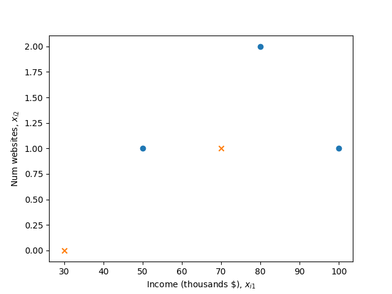

## Solution to Homework 04

Name: Chen Shen

NetID: cs5236

### 1.

(a) A possible variable could be the frequency, i.e. a vector of STFT. There are two classes, male or female.

(b) A possible variable could be the position of the stylus, i.e. a vector of $(x,y)$, which represents the coordinate. Since 0-9, a-z and A-Z are included, there are $10+26+26=62$ classes.

### 2. 

(a) First, we have 
$$
P(y=0|\mathbf{x})=1-P(y=1|\mathbf{x})=1-\frac{1}{1-e^{-z}}
$$
Hence, 
$$
\begin{aligned}
&&P(y=1|\mathbf{x})&>P(y=0|\mathbf{x}) \\
\Longrightarrow && \frac{1}{1+e^{-z}}&>\frac{e^{-z}}{1+e^{-z}} \\
\Longrightarrow && e^{-z}&<1 \\
\Longrightarrow && z&>0
\end{aligned}
$$

(b) 
$$
\begin{aligned}
&&P(y=1|\mathbf{x})&>0.8 \\
\Longrightarrow && \frac{1}{1+e^{-z}}&>0.8 \\
\Longrightarrow && 1+e^{-z}&<1.25 \\
\Longrightarrow && e^{-z}&<0.25 \\
\Longrightarrow && z&>-\ln{0.25}=\ln{4}
\end{aligned}
$$

(c) Based on problem (b), there is $z>\ln{4}$. Besides, $x_2=0.5$
$$
\begin{aligned}
&& \beta_0+\beta_1 x_1+\beta_2 x_2&>\ln{4} \\
\Longrightarrow && 1+2x_1+3\cdot 0.5&>\ln{4} \\
\Longrightarrow && x_1&>\ln{2}-1.25
\end{aligned}
$$

### 3. 

(a) 
{width=40%}

(b) For example, $x_{i2}=0.5$. That is
$$
z_i=\mathbf{w}^\mathrm{T}\mathbf{x}_i+b=x_{i2}-0.5
$$
So 
$$
\mathbf{w}=\left[
\begin{matrix}
0 &1
\end{matrix} \right]
$$
$$
b=-0.5
$$

(c) 

+:-------------------------------+:-----------------------+:-----------------------+:----------------------+:------------------------+:------------------------+
| Income(thousands \$), $x_{i1}$ | 30                     | 50                     | 70                    | 80                      | 100                     |
+--------------------------------+------------------------+------------------------+-----------------------+-------------------------+-------------------------+
| Num websites, $x_{i2}$         | 0                      | 1                      | 1                     | 2                       | 1                       |
+--------------------------------+------------------------+------------------------+-----------------------+-------------------------+-------------------------+
| Donate (1=yes or 0=no), $y_i$  | 0                      | 1                      | 0                     | 1                       | 1                       |
+--------------------------------+------------------------+------------------------+-----------------------+-------------------------+-------------------------+
| $z_i=x_{i2}-0.5$               | -0.5                   | 0.5                    | 0.5                   | 1.5                     | 0.5                     |
+--------------------------------+------------------------+------------------------+-----------------------+-------------------------+-------------------------+
| $P(y_i|\mathbf{x}_i)$          | $\frac{1}{1+e^{-0.5}}$ | $\frac{1}{1+e^{-0.5}}$ | $\frac{1}{1+e^{0.5}}$ | $\frac{1}{1+e^{-1.5}}$  | $\frac{1}{1+e^{-0.5}}$  |
+--------------------------------+------------------------+------------------------+-----------------------+-------------------------+-------------------------+

From the table, we know that sample $3$ is the least likely.

(d)
$$
\begin{aligned}
z_i'&=(\mathbf{w}')^\mathrm{T}\mathbf{x}_i+b' \\
&=\alpha\left[\mathbf{w}^\mathrm{T}\mathbf{x}_i+b\right] \\
&=\alpha z_i
\end{aligned}
$$
Notice that the sign of $z_i'$ is the same as $z_i$.
So the $\hat{y}$ will not change.       
However, the probabilities will change. For example, $\alpha>1$.
Since for $z_i>0$, $z_i'>z_i$; for $z_i<0$, $z_i'<z_i$, 
we can tell that for $P(y_i=1|\mathbf{x})>0.5$, the probability will increase; for $P(y_i=1|\mathbf{x})<0.5$, the probability will decrease.

### 4.

(a) 
$$
\begin{aligned}
z_i&=\beta_0+\beta_1 x_{1i}+\beta_2 x_{2i} \\
&=-6+0.05\cdot 40+1\cdot 3.5
&=-0.5
\end{aligned}
$$
$$
P(Y)=\frac{1}{1+e^{-z_i}}=\frac{1}{1+e^{0.5}}=0.378
$$

(b) In order to make 
$$
P(Y)=\frac{1}{1+e^{-z_i}}\geq0.5
$$
There must be
$$
z_i\geq 0
$$
Also we have
$$
\begin{aligned}
z_i&=\beta_0+\beta_1 x_{1i}+\beta_2 x_{2i} \\
&=-6+0.05 x_{1i}+1\cdot 3.5 \\
&=-2.5+0.05x_{1i}
\end{aligned}
$$
Hence,
$$
x_{1i}\geq 50
$$
So the student needs to study 50 hours.

### 5.

(a) 
$$
\frac{\partial z_i}{\partial \beta_0}=1
$$
$$
\frac{\partial z_i}{\partial \beta_1}=x_{1i}
$$
$$
\frac{\partial z_i}{\partial \beta_2}=x_{2i}
$$

(b)
$$
\frac{\partial J}{\partial \beta_0}
=\frac{\partial J}{\partial z_i}\cdot\frac{\partial z_i}{\partial \beta_0}
=\sum_{i=1}^N\left(\frac{1}{1+e^{z_i}}\cdot e^{z_i}\cdot 1-y_i\cdot 1\right)
=\sum_{i=1}^N\left(\frac{e^{z_i}}{1+e^{z_i}}-y_i\right)
$$
$$
\frac{\partial J}{\partial \beta_1}
=\frac{\partial J}{\partial z_i}\cdot\frac{\partial z_i}{\partial \beta_1}
=\sum_{i=1}^N\left(\frac{1}{1+e^{z_i}}\cdot e^{z_i}\cdot x_{1i}-y_i\cdot x_{1i}\right)
=\sum_{i=1}^N\left(\frac{e^{z_i}x_{1i}}{1+e^{z_i}}-y_ix_{1i}\right)
$$
$$
\frac{\partial J}{\partial \beta_2}
=\frac{\partial J}{\partial z_i}\cdot\frac{\partial z_i}{\partial \beta_2}
=\sum_{i=1}^N\left(\frac{1}{1+e^{z_i}}\cdot e^{z_i}\cdot x_{2i}-y_i\cdot x_{2i}\right)
=\sum_{i=1}^N\left(\frac{e^{z_i}x_{2i}}{1+e^{z_i}}-y_ix_{2i}\right)
$$

(c) Let $\frac{\partial J}{\partial \beta_0}=0$, $\frac{\partial J}{\partial \beta_1}=0$, $\frac{\partial J}{\partial \beta_2}=0$. Then sum them all. We will have
$$
\sum_{i=1}^N\left(\frac{e^{z_i}z_i}{1+e^{z_i}}-y_iz_i\right)=0
$$
This is a transcendental equation. So there is no analytical solutions. To optimize the loss function, we can use some numerical methods, such as gradient descent.
