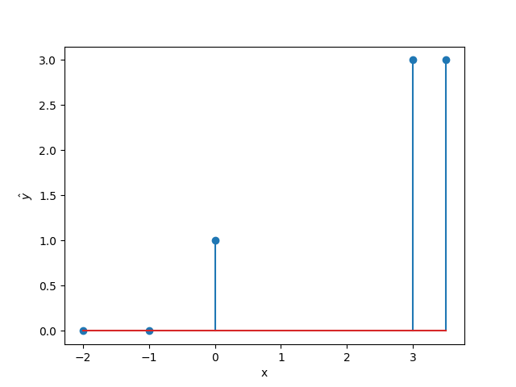
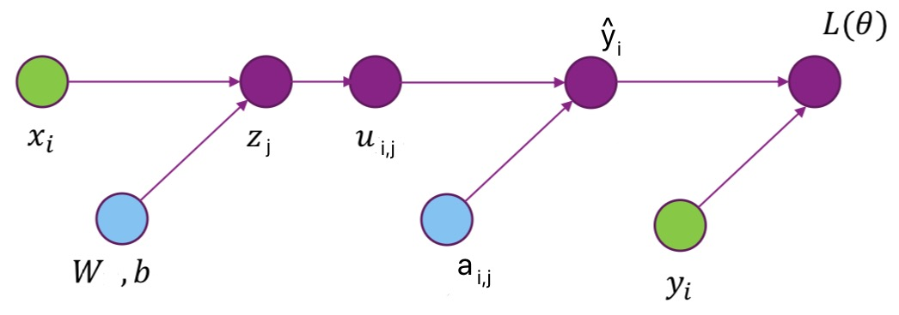

# Solution to Homework 07

Name: Chen Shen

NetID: cs5236

## 1.

(a) The linears function in the hidden layer are
$$
\mathbf{z}^\mathrm{H}=\mathbf{W}^\mathrm{H}\mathbf{x}+\mathbf{b}^\mathrm{H}
=\left[
\begin{matrix}
1 &0 &1 \\
0 &1 &1 \\
1 &1 &0 \\
1 &1 &1 
\end{matrix}
\right]
\left[
\begin{matrix}
x_1  \\
x_2  \\
x_3
\end{matrix}
\right]
+\left[
\begin{matrix}
0 \\
0 \\
-1 \\
1
\end{matrix}
\right]
=\left[
\begin{matrix}
x_1+x_3 \\
x_2+x_3 \\
x_1+x_2-1 \\
x_1+x_2+x_3+1
\end{matrix}
\right]
$$
So the activation functions are
$$
\mathbf{u}^\mathrm{H}=g_\text{act}(\mathbf{z}^\mathrm{H})
=\left[
\begin{matrix}
g_\text{act}(x_1+x_3) \\
g_\text{act}(x_2+x_3) \\
g_\text{act}(x_1+x_2-1) \\
g_\text{act}(x_1+x_2+x_3+1)
\end{matrix}
\right]
=\left[
\begin{matrix}
𝟙_{(x_1+x_3\geq 0)} \\
𝟙_{(x_2+x_3\geq 0)} \\
𝟙_{(x_1+x_2\geq 1)} \\
𝟙_{(x_1+x_2+x_3\geq -1)}
\end{matrix}
\right]
$$

(b)
$$
\begin{aligned}
z^\circ
&=W^\circ\mathbf{u}^\mathrm{H}+b^\circ
=\left[
\begin{matrix}
1 &1 &-1 &-1
\end{matrix}
\right]
\left[
\begin{matrix}
𝟙_{(x_1+x_3\geq 0)} \\
𝟙_{(x_2+x_3\geq 0)} \\
𝟙_{(x_1+x_2\geq 1)} \\
𝟙_{(x_1+x_2+x_3\geq -1)}
\end{matrix}
\right]
-1.5 \\
&=𝟙_{(x_1+x_3\geq 0)} + 𝟙_{(x_2+x_3\geq 0)} - 𝟙_{(x_1+x_2\geq 1)} - 𝟙_{(x_1+x_2+x_3\geq -1)} -1.5
\end{aligned}
$$
In the region that 
$$
x_1+x_3\geq 0, x_2+x_3\geq 0, x_1+x_2-1<0, x_1+x_2+x_3+1<0
$$
we have
$$
z^\circ=1+1-0-0-1.5=0.5
$$
Outside the region, we have $z^\circ<0$.
So 
$$
\hat{y}
=\begin{cases}
1 &x_1+x_3\geq 0, x_2+x_3\geq 0, x_1+x_2-1<0, x_1+x_2+x_3+1<0 \\
0 &\text{otherwise}
\end{cases}
$$

## 2.

(a) Since $N_h$ has 3 outputs, $N_h=3$.
$$
\mathbf{z}^\mathrm{H}=\mathbf{W}^\mathrm{H}\mathbf{x}+\mathbf{b}^\mathrm{H}
=\left[
\begin{matrix}
-1 \\
1 \\
1 
\end{matrix}
\right]
x
+\left[
\begin{matrix}
-1 \\
1 \\
-2
\end{matrix}
\right]
=\left[
\begin{matrix}
-x-1 \\
x+1 \\
x-2 
\end{matrix}
\right]
$$
The activation outputs are 
$$
\mathbf{u}^\mathrm{H}
=\left[
\begin{matrix}
\max\{0, -x-1\} \\
\max\{0, x+1\} \\
\max\{0, x-2\}
\end{matrix}
\right]
$$

(b)
$$
\hat{y}=g_\text{out}(z^\circ)=z^\circ
$$
So the loss function could be
$$
L=||y-\hat{y}||^2=||y-z^\circ||^2
$$
where
$$
\begin{aligned}
z^\circ&=\sum_{k=1}^3W_k^\circ u_k^\mathrm{H}+b^\circ \\
&=W_1^\circ\max\{0, -x-1\} + W_2^\circ\max\{0, x+1\} + W_3^\circ\max\{0, x-2\} + b^\circ
\end{aligned}
$$

(c) Assume that
$$
\mathbf{A}=
\left[
\begin{matrix}
b^\circ &W^\circ
\end{matrix}
\right]
$$
$$
\mathbf{X}=
\left[
\begin{matrix}
\mathbf{1} \\
\mathbf{u}^\mathrm{H}
\end{matrix}
\right]
$$
Then we have
$$
y^\circ=z^\circ=\mathbf{A}\mathbf{X}
$$
So
$$
L=||y-z^\circ||^2=||y-\mathbf{A}\mathbf{X}||^2
$$
Let
$$
\frac{\partial L}{\partial A}=-2(\mathbf{y}-\mathbf{A}\mathbf{X})\mathbf{X}^\mathrm{T}=0
$$
Thus
$$
\left[
\begin{matrix}
b^\circ &W^\circ
\end{matrix}
\right]=
\mathbf{A}=\mathbf{y}\mathbf{X}^\mathrm{T}(\mathbf{X}\mathbf{X}^\mathrm{T})^{-1}
$$
Functions in Python3:
    ```{.python .numberLines}
    def get_table():
        return np.matrix([-2, -1, 0, 3, 3.5]), np.matrix([0, 0, 1, 3, 3])

    def get_uH():
        x, y = get_table()
        WH = np.matrix([-1, 1, 1]).T
        bH = np.matrix([-1, 1, -2]).T
        zH = WH * x + bH
        uH = zH
        uH[uH<0] = 0
        return uH

    def get_Wb():
        _, y = get_table()
        uH = get_uH()
        X = np.vstack((uH, np.ones((1,5))))
        X = np.matrix(X)
        A = y * X.T * (X * X.T).I
        return np.ravel(A[0,:-1]), A[0,-1]

    def p2_c():
        Wo, bo = get_Wb()
        print('The bias is', bo)
        print('The weights are', Wo)
    ```
    Output:
    ```
    $ python3 HW7.py p2_c
    The bias is 2.886579864025407e-15
    The weights are [-2.88657986e-15  1.00000000e+00 -1.00000000e+00]
    ```

(d)     
Functions in Python3:
    ```{.python .numberLines}
    def get_table():
        return np.matrix([-2, -1, 0, 3, 3.5]), np.matrix([0, 0, 1, 3, 3])

    def get_uH():
        x, y = get_table()
        WH = np.matrix([-1, 1, 1]).T
        bH = np.matrix([-1, 1, -2]).T
        zH = WH * x + bH
        uH = zH
        uH[uH<0] = 0
        return uH

    def get_Wb():
        _, y = get_table()
        uH = get_uH()
        X = np.vstack((uH, np.ones((1,5))))
        X = np.matrix(X)
        A = y * X.T * (X * X.T).I
        return np.ravel(A[0,:-1]), A[0,-1]

    def p2_d():
        x, _ = get_table()
        Wo, bo = get_Wb()
        uH = get_uH()
        yhat = Wo * uH + bo
        x = np.ravel(x)
        yhat = np.ravel(yhat)
        plt.stem(x, yhat)
        plt.xlabel('x')
        plt.ylabel(r'$\hat{y}$')
        plt.savefig('image/2d.png')
    ```
    Output:     
    {width=60%}

(e)     
Function in Python3:
    ```{.python .numberLines}
    def predict(x, y, WH, bH, Wo, bo):
        zH = WH * x + bH
        uH = zH
        uH[uH<0] = 0
        yhat = Wo * uH + bo
        return yhat
    ```
    Note that all of the arguments are in the type of `numpy.matrix`, where `x` and `y` have only one row, `WH` and `bH` have only one column, `Wo` and `bo` have only one row.

## 3.

(a)
$$
z_{i,j}=\sum_{k=1}^{N_i}W_{jk}x_{i,k}+b_j
$$
$$
u_{i,j}=\frac{1}{1+e^{-z_{i,j}}}
$$
$$
\hat{y_i}=\frac{\sum_{j=1}^Ma_{i,j}u_{i,j}}{\sum_{j=1}^Mu_{i,j}}
$$

(b) $W_j$, $b_j$ and $a_{i,j}$ are trainable parameters.     
{width=60%}

(c)
$$
\frac{\partial L}{\partial \hat{y_i}}=-2(y_i-\hat{y_i})
$$

(d) It can be computed by chain rule, i.e.
$$
\frac{\partial L}{\partial \mathbf{u}}=\frac{\partial L}{\partial \hat{\mathrm{y}}}\frac{\partial \hat{\mathrm{y}}}{\partial u}
=\frac{\partial L}{\partial \hat{\mathrm{y}}}\frac{a_{i,j}\sum_{j=1}^Mu_{i,j}-\sum_{j=1}^Ma_{i,j}u_{i,j}}{(\sum_{j=1}^Mu_{i,j})^2}
$$

(e) Using chain rule.
$$
\frac{\partial L}{\partial \mathbf{z}}=\frac{\partial L}{\partial \mathbf{u}}\frac{\partial \mathbf{u}}{\partial z}
=\frac{\partial L}{\partial \mathbf{u}}\frac{e^{-z_{i,j}}}{(1+e^{-z_{i,j}})^2}
$$

(f)
$$
\frac{\partial L}{\partial W_{jk}}=\frac{\partial L}{\partial \mathbf{z}}\frac{\partial \mathbf{z}}{\partial W_{jk}}=x_{ik}\frac{\partial L}{\partial \mathbf{z}}
$$
$$
\frac{\partial L}{\partial b_j}=\frac{\partial L}{\partial \mathbf{z}}\frac{\partial \mathbf{z}}{\partial b_j}=\frac{\partial L}{\partial \mathbf{z}}
$$

(g) In conclusion,
$$
\frac{\partial L}{\partial W_{jk}}=-2(y_i-\hat{y_i})\frac{a_{i,j}\sum_{j=1}^Mu_{i,j}-\sum_{j=1}^Ma_{i,j}u_{i,j}}{(\sum_{j=1}^Mu_{i,j})^2}\frac{e^{-z_{i,j}}}{(1+e^{-z_{i,j}})^2}x_{ik}
$$
$$
\frac{\partial L}{\partial b_j}=-2(y_i-\hat{y_i})\frac{a_{i,j}\sum_{j=1}^Mu_{i,j}-\sum_{j=1}^Ma_{i,j}u_{i,j}}{(\sum_{j=1}^Mu_{i,j})^2}\frac{e^{-z_{i,j}}}{(1+e^{-z_{i,j}})^2}
$$

(h) Function in Python3:    
    ```{.python .numberLines}
    import numpy as np
    def compute_grad(u, a, pL_py):
        py_pu = (a * np.sum(u, axis=0) - np.sum(a*u, axis=0)) / (np.sum(u, axis=0))**2
        return pL_py * py_pu
    ```
