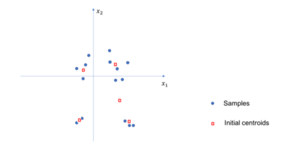

# Solution to Homework 10

Name: Chen Shen

NetID: cs5236

## 1.

{width=80%}

## 2.

Since we already have $K$ known means, for each testing sample, we have to compute the distance to any mean, which would take $K\times D$ computations. So generally, for $N$ samples, $K\times D\times N$ computations are needed.

## 3.

For each new sample, first we need to classify it into one of the cluster, which is similar to the previous problem, taking $K\times D$ computations. For all new samples, this step would take $K\times D\times N$ computations in total. Then in each loop, a new mean will be computed and updated, which takes $K$ computations. Hence, $(K\times D\times N + K)\times T$ computations are needed in total.
